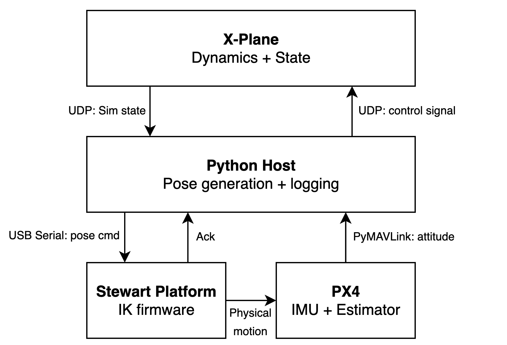
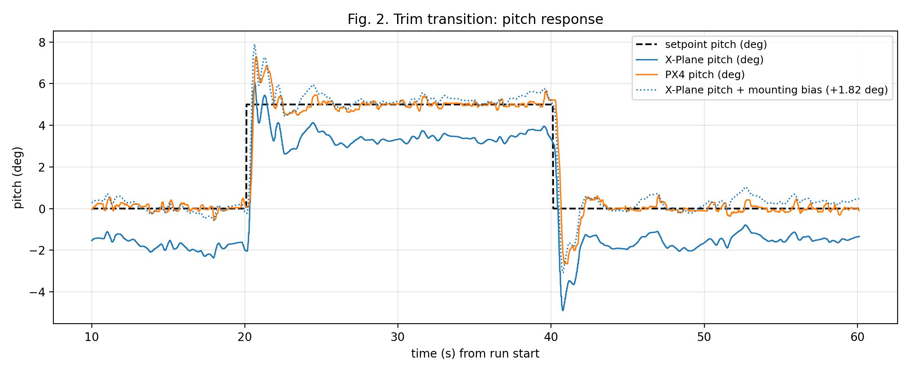
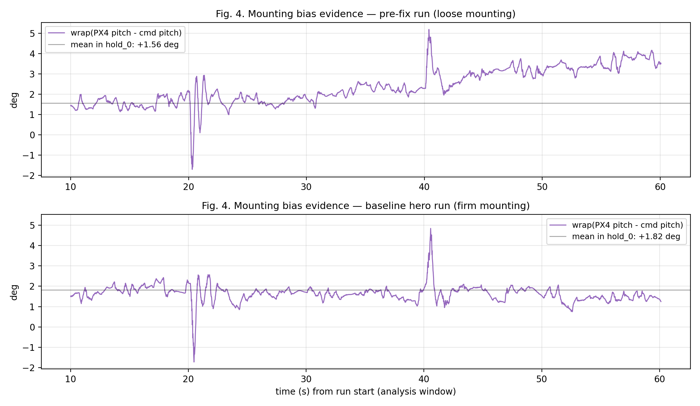
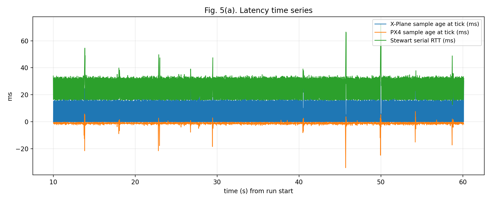
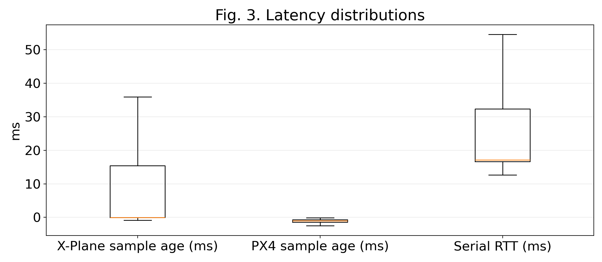

# 서론
HILS(Hardware-In-the-Loop-Simulation)는 비행제어 시스템 개발 과정에서 실 비행 시험 이전에 제어 로직과 소프트웨어 통합을 검증함으로써 비용과 위험을 줄이는 대표적인 방법이다. 
그러나 기존의 많은 HILS 구성은 센서 신호를 시뮬레이션 값으로 대체하거나, 자세 응답을 화면/로그 기반으로만 확인하는 경우가 많다. 이 경우 비행제어기(Flight Controller)의 IMU 및 자세추정기(Estimator)가 실제 운동으로부터 발생하는 관성 자극, 시간 지연, 포화(saturation) 및 구동기 제약의 영향을 충분히 경험하지 못해, 폐루프 거동의 현실성이 제한될 수 있다.
본 연구는 이러한 한계를 보완하기 위해, 시뮬레이터의 자세/운동을 실제 물리 운동으로 구현하는 물리 기반 HILS 플랫폼을 제안한다. X‑Plane에서 생성된 항공기 동역학 상태(자세/운동)를 호스트 인터페이스가 수신하여 스튜어트 플랫폼의 포즈 명령으로 변환하고, 플랫폼 상부에 탑재된 실제 비행제어기(Pix32 v6, PX4)가 플랫폼 운동에 의해 물리적으로 자극된 IMU 신호를 기반으로 자세를 추정한다. 즉, 센서 입력을 단순 합성하는 방식이 아니라 실제 관성 운동을 통해 얻어진 자세 정보를 폐루프 피드백으로 활용한다는 점에서 차별성이 있다.
제안 시스템은 시뮬레이션과 하드웨어가 물리적으로 연결된 폐루프 구조를 갖는다. 호스트는 UDP를 통해 X‑Plane 상태를 수신하고, USB 시리얼을 통해 스튜어트 플랫폼에 자세 명령을 전달하며, 동시에 MAVLink를 통해 PX4의 자세 텔레메트리를 취득한다. 이후 호스트는 물리 IMU 기반 자세 추정치를 피드백으로 사용하여 X‑Plane에 조종면 명령을 주입함으로써 “시뮬레이터가 실물 운동을 구동하고, 실물에서 측정된 응답이 다시 시뮬레이터에 반영되는” 반복 실험 환경을 구성한다.
본 논문의 기여는 다음과 같다. (i) X‑Plane–스튜어트 플랫폼–PX4 비행제어기를 통합한 물리 폐루프 HILS 아키텍처를 설계 및 구현하고, (ii) 트림 유지 및 트림 전이(예: 피치 스텝) 시나리오 기반의 재현 가능한 실험/로깅 절차를 제시하며, (iii) 추종 오차와 지연 시간을 정량화하고, 작업공간 한계, 포화 거동, 구동기/통신 주기 제약 등 시스템 한계를 분석한다.
다만 제안 플랫폼은 기존 HILS를 대체하기보다는 보완하는 도구로서의 성격을 갖는다. 스튜어트 플랫폼의 기구학적 범위로 인해 자세 구현 범위가 제한되며, 공력과 같은 외력은 물리적으로 재현되지 않는다. 그럼에도 불구하고 가능한 작업공간 내에서 본 시스템은 자세 응답을 직관적으로 관찰할 수 있고, 지연 및 포화가 폐루프 거동에 미치는 영향을 실측 기반으로 평가할 수 있어, 실비행 이전 단계에서 유용한 검증 환경을 제공한다.

# 본론
## 1. 시스템 아키텍처
본 연구는 시뮬레이터에서 생성된 자세/운동을 실제 물리 운동으로 구현하고, 이를 실물 IMU가 직접 감지하도록 구성된 물리 폐루프 HILS 시험 플랫폼을 구현하였다. 
전체 루프는 (i) X‑Plane이 항공기 자세/운동 상태를 실시간으로 생성하고, (ii) 호스트 컴퓨터가 UDP로 해당 상태를 수신하여 포즈 명령으로 변환하며, (iii) 스튜어트 플랫폼이 명령된 포즈를 수행하고, (iv) 플랫폼에 탑재된 실제 비행제어기(Pix32 v6, PX4)가 onboard IMU 기반 자세를 추정하고, (v) 호스트가 MAVLink로 PX4 자세 텔레메트리를 수신하여 UDP로 X‑Plane에 조종면 명령을 주입하는 구조로 구성된다. 
본 구조는 센서 신호를 단순 합성하는 기존 HILS와 달리, IMU/추정기가 실제 운동 자극을 경험하도록 함으로써 폐루프 거동의 현실성을 높인다는 점에서 차별성이 있다.

그림 1은 본 연구에서 구현한 물리 폐루프 HILS의 전체 데이터 흐름 및 인터페이스(UDP/USB Serial/MAVLink)를 나타낸다.

## 2. 인터페이스, 업데이트율, 로깅
본 시스템은 세 가지 통신 링크를 사용한다. 첫째, X‑Plane은 UDP를 통해 상태 패킷을 고정 출력률(예: 50 Hz)로 호스트에 전송하며, 호스트는 X‑Plane DATA 패킷 메커니즘을 이용해 UDP로 제어 입력을 전송한다. 둘째, 호스트는 USB 시리얼로 스튜어트 플랫폼 MCU에 포즈 명령(병진 + 오일러 각)을 전송하고, MCU는 각 포즈 명령에 대해 1개의 ACK/상태 메시지를 반환한다. 
셋째, PX4는 MAVLink(ATTITUDE 메시지)를 통해 자세 추정치를 요청된 스트림 속도(예: 100 Hz)로 호스트에 전송한다. 
모든 입력 스트림은 호스트에서 수신 시점에 단조(monotonic) 클록으로 타임스탬프를 부여하며, 포즈 명령 역시 전송 시점 타임스탬프를 기록한다. 이를 통해 추종 오차 및 지연/지터 특성의 일관된 정량 평가가 가능하다.

## 3. 자세 매핑 및 좌표/각도 정의
X‑Plane은 roll/pitch와 heading을 제공하고, PX4는 roll/pitch/yaw를 제공한다. heading의 래핑(wrap-around) 문제를 방지하기 위해 yaw/heading은 [−180∘ ,180∘) 범위로 래핑하여 비교하며, (필요 시) 플랫폼 yaw를 초기 시뮬레이터 heading에 대한 상대값으로 명령하여 시작 시점을 0으로 정렬한다. 각 실행(run) 동안 호스트는 시뮬레이터 자세를 추종하도록 플랫폼 포즈를 생성하며, 초기 구동 시 급격한 운동을 줄이기 위해 hold 및 ramp 기반의 시작 형상화(shaping)를 적용한다.

## 4. 폐루프 제어 구성
베이스라인 구성에서 PX4는 주로 물리 IMU/추정기로서 자세 피드백을 제공하며, X‑Plane 제어 입력은 호스트에서 구현된 PID 제어기로 계산된다. 
각 호스트 제어 틱마다 최신 PX4 자세를 이용해 elevator/aileron/rudder 조종면 명령을 생성하고, X‑Plane 입력 범위에 맞게 클램핑한다. 
또한 초기 교란과 적분 포화를 방지하기 위해 일정 지연 후 제어 주입을 활성화하며, 활성화 이전에는 PID 상태를 리셋한다. 이는 본 논문의 평가 목표를 “PX4 내부 자세제어기 튜닝”이 아니라 “물리 감지 및 타이밍 특성을 포함한 폐루프 HILS 동작”에 두기 위한 설계이다.

## 5. 실험 시나리오 및 절차
재현 가능한 데이터셋 확보를 위해 “트림 전이(trim transition)” 시나리오를 사용한다. 
각 run은 기준 setpoint에서의 warmup 구간 후 피치 스텝(예: 0∘ → +5∘)을 일정 시간 유지하고, (선택적으로) 기준값으로 복귀하는 순서로 구성된다. 
동일 초기조건을 유지하기 위해 각 반복(run)은 시뮬레이터를 초기 상태로 재설정한 후 수행하며, N=3∼5회 반복을 통해 통계적 신뢰도를 확보한다. 
주요 로깅 신호는 (i) X‑Plane 자세, (ii) PX4 자세 추정치, (iii) 플랫폼 명령 포즈, (iv) 스튜어트 ACK의 타이밍 필드이다. 
베이스라인 실험은 플랫폼 작업공간 내에서 수행되도록 설계되었으므로, 포화/클램핑은 관측되지 않거나 매우 미미할 것으로 기대되며, 이를 통해 경계효과 없이 명목(nominal) 성능을 평가한다.

## 6. 평가 지표: 추종 오차 및 지연
추종 성능은 물리 신호와 시뮬레이션 신호의 자세 차이로 정량화한다. 
주요 지표는 roll/pitch에 대해 PX4 자세와 X‑Plane 자세의 래핑된 각도 오차이며(정렬이 활성화된 경우 yaw/heading 포함), 초기 warmup을 제외한 분석 구간에서 평균, 표준편차, RMS, 최대 절대값을 산출한다. 또한 비행제어기(FC) 장착 자세의 고정 오프셋(마운팅 바이어스)을 분리하기 위해, 시나리오의 정지 구간(예: `hold_0`)에서 PX4 자세와 플랫폼 포즈(플랫폼에 전달된 명령 포즈, `cmd_roll/cmd_pitch`)의 차이를 평균하여 roll/pitch 바이어스를 추정하고, 이를 PX4 자세에서 제거한 후(바이어스 보정) X‑Plane 대비 추종 오차를 재산출한다. 
타이밍 성능은 (i) 호스트 틱에서의 X‑Plane/PX4 샘플 age, (ii) 포즈 전송부터 ACK 수신까지의 시리얼 RTT, (iii) 상태 수신 시점(예: X‑Plane 또는 PX4)부터 해당 틱에서 발행된 포즈의 ACK 수신 시점까지의 end-to-end proxy 지연으로 평가한다. 
이러한 지표는 주요 지연 원인과 변동성을 드러내며, 이는 폐루프 대역폭과 안정성에 직접적인 영향을 준다.

## 7. 결과 및 논의(예시 서술)
본 절에서는 베이스라인 실험(트림 전이; pitch 0∘ → +5∘ → 0∘)에서 수집된 로그를 바탕으로, (i) 물리 폐루프 HILS의 동작 확인, (ii) 추종 오차의 정량화, (iii) 잔여 오차의 원인(FC 장착 바이어스) 근거, (iv) 지연/타이밍 특성에 기반한 한계 설명을 제시한다. 본 연구의 베이스라인 데이터는 run \#5–\#9를 기준으로 하며, 시각화 품질 및 오차 지표를 기준으로 선정된 대표 run(예: run \#8)을 “baseline hero run”으로 사용한다.

그림 2는 트림 전이 시나리오에서 setpoint, X‑Plane pitch, PX4 pitch를 동일 시간축에서 비교한 결과이다. PX4 pitch는 setpoint 변화에 대해 안정적으로 추종하며, 응답에는 일정한 위상 지연이 관측된다. 또한 X‑Plane pitch에 FC 장착 바이어스(정지 구간에서 추정된 상수 오프셋)를 적용한 경우(X‑Plane pitch + mounting bias), PX4 pitch와의 정합이 개선되는 경향을 확인할 수 있다.

그림 3은 pitch 추종 오차의 시간 변화를 나타낸다. raw error(PX4 − X‑Plane)는 분석 구간에서 준정적 오프셋 성분을 포함하는 형태로 나타나며, 이는 “오차가 시간에 따라 크게 요동하는 동특성 문제”보다는 “상수에 가까운 바이어스 성분”이 지배적일 가능성을 시사한다. 정지 구간(`hold_0`)에서 PX4와 플랫폼 명령 포즈(`cmd_pitch`)의 차이로 추정한 바이어스를 제거한 bias-corrected error는 raw error 대비 평균 오프셋이 감소하며, 잔여 오차의 분포가 0 근처로 이동하는 것을 확인할 수 있다.

그림 4는 FC 장착 바이어스의 직접적인 근거를 제시한다. 본 연구에서는 정지 구간에서의 wrap(px4_pitch - cmd_pitch)를 “FC 장착 바이어스(플랫폼 포즈 대비 FC/IMU 프레임 오프셋)”의 관측치로 정의하였다. 장착이 불안정했던 pre-fix run에서는 해당 값이 상대적으로 불규칙하고 시간에 따른 변동이 큰 반면, 장착을 고정한 baseline hero run에서는 일정한 평균값 주변으로 안정화되는 경향이 나타난다. 이는 run \#5 이후 관측되는 “부드럽고 일관된 오프셋 형태의 잔여 오차”가 FC 장착 바이어스 성분에 의해 지배될 수 있음을 뒷받침한다.

그림 5는 로그 기반으로 측정한 지연/타이밍 특성을 나타낸다. (a)에서는 X‑Plane 및 PX4 샘플 age, Stewart serial RTT의 시간 변화를 제시하고, (b)에서는 run \#5–\#9에 대한 분포를 요약한다. 이러한 지연 특성은 그림 2에서 관측되는 위상 지연 및 폐루프 응답의 한계를 설명하는 주요 근거로 활용된다. 또한 베이스라인(run \#5–\#9)에서는 포화 지표가 0%로 유지되어, 본 절의 결과가 포화/클램핑이 아닌 명목(nominal) 구간의 동작을 반영함을 확인하였다.

지연 지표의 정의는 다음과 같다.

- **Serial RTT (ms)**: 호스트가 플랫폼에 포즈 명령을 전송한 시각(`t_tick_ns`)부터, 해당 명령에 대응하는 ACK가 호스트에 수신된 시각(`t_rx_ns`)까지의 시간.
- **X‑Plane sample age at tick (ms)**: 제어 틱 시각(`t_tick_ns`)에서 최신 X‑Plane 상태가 수신된 시각(`xp_t_rx_ns`)이 얼마나 오래되었는지를 나타내는 값, \((t\\_tick\\_ns - xp\\_t\\_rx\\_ns)/10^6\).
- **PX4 sample age at tick (ms)**: 제어 틱 시각(`t_tick_ns`)에서 최신 PX4 ATTITUDE가 수신된 시각(`px4_t_rx_ns`)의 경과 시간, \((t\\_tick\\_ns - px4\\_t\\_rx\\_ns)/10^6\).
- **PX4 rx→ACK (ms)**: 제어 틱에서 사용된 최신 PX4 샘플 수신 시각(`px4_t_rx_ns`)부터, 해당 틱에서 전송된 포즈 명령의 ACK 수신 시각까지의 end-to-end proxy 지연.
- **X‑Plane rx→ACK (ms)**: 제어 틱에서 사용된 최신 X‑Plane 샘플 수신 시각(`xp_t_rx_ns`)부터, 해당 틱에서 전송된 포즈 명령의 ACK 수신 시각까지의 end-to-end proxy 지연.

### 표 1. Pitch tracking error 요약 (run \#5–\#9, 분석 구간: warmup 10s 제외)

| Run | mean (deg) | RMS (deg) | p95 abs (deg) | max abs (deg) |
|---|---:|---:|---:|---:|
| \#5 (fix mounting) | 2.0540 | 2.0963 | 2.5246 | 4.8690 |
| \#6 | 2.1277 | 2.1830 | 2.8178 | 4.3592 |
| \#7 | 1.9254 | 1.9630 | 2.4756 | 3.9897 |
| \#8 | 1.6338 | 1.6827 | 2.1238 | 4.8438 |
| \#9 | 2.0831 | 2.1427 | 2.7336 | 4.6308 |

### 표 1-b. Pitch error (bias removed) 요약 (run \#5–\#9)

본 표는 정지 구간(`hold_0`)에서 추정한 pitch 마운팅 바이어스 \(b\\_\\text{pitch} = \\text{mean}(wrap(px4\\_pitch - cmd\\_pitch))\)를 PX4 pitch에서 제거한 후의 오차를 요약한다.

| Run | bias_pitch mean (deg) | bias_pitch std (deg) | raw RMS (deg) | raw p95 abs (deg) | bias-corr RMS (deg) | bias-corr p95 abs (deg) |
|---|---:|---:|---:|---:|---:|---:|
| \#5 | 2.0084 | 0.2096 | 2.0963 | 2.5250 | 0.4214 | 0.6140 |
| \#6 | 1.7460 | 0.2234 | 2.1830 | 2.8179 | 0.6198 | 1.0876 |
| \#7 | 1.8265 | 0.2191 | 1.9630 | 2.4758 | 0.3951 | 0.6889 |
| \#8 | 1.8185 | 0.2387 | 1.6827 | 2.1252 | 0.4432 | 0.7461 |
| \#9 | 1.7282 | 0.2948 | 2.1427 | 2.7336 | 0.6147 | 1.0440 |

### 표 2. Latency 요약 (run \#5–\#9, 단위: ms; 포화: % time)

| Run | Serial RTT mean | Serial RTT p95 | Serial RTT max | PX4 rx→ACK mean | PX4 rx→ACK p95 | PX4 rx→ACK max | X‑Plane rx→ACK mean | X‑Plane rx→ACK p95 | X‑Plane rx→ACK max | Saturation (% time) |
|---|---:|---:|---:|---:|---:|---:|---:|---:|---:|---:|
| \#5 (fix mounting) | 21.7627 | 33.9212 | 65.0500 | 20.6623 | 33.2395 | 63.7002 | 30.7208 | 62.4697 | 80.0690 | 0.0 |
| \#6 | 21.7398 | 33.8954 | 54.4494 | 20.6083 | 33.1112 | 46.1230 | 26.7176 | 48.9724 | 79.8520 | 0.0 |
| \#7 | 21.5830 | 33.7010 | 50.0613 | 20.4293 | 32.9395 | 42.3585 | 26.4289 | 48.8591 | 65.1295 | 0.0 |
| \#8 | 21.8969 | 33.5583 | 72.5507 | 20.7169 | 33.0030 | 66.0645 | 31.2639 | 62.7551 | 97.5157 | 0.0 |
| \#9 | 21.6695 | 33.8642 | 81.4045 | 20.5575 | 33.0931 | 80.8785 | 29.3779 | 49.5338 | 104.9433 | 0.0 |

# 결론
본 연구에서는 X‑Plane 기반 비행 동역학 시뮬레이션, 스튜어트 플랫폼, 그리고 PX4 기반 비행제어기(탑재 IMU 및 자세추정기)를 통합하여, 시뮬레이터의 자세/운동을 실제 물리 운동으로 구현하고 실물 IMU가 이를 직접 감지하는 물리 폐루프 HILS 시험 플랫폼을 구축하였다. 제안 시스템은 시뮬레이터 출력이 플랫폼 운동을 구동하고, 플랫폼에 탑재된 비행제어기의 자세 추정값이 다시 시뮬레이터 제어입력 생성에 활용되는 폐루프 구조를 통해, 기존의 센서 신호 합성 중심 HILS 대비 보다 직관적이며 현실적인 검증 환경을 제공한다.
또한 트림 전이(예: 피치 0∘ → +5∘ → 0∘) 시나리오를 기반으로 반복 실험을 수행하고, X‑Plane 자세, PX4 자세 추정치, 플랫폼 명령 및 ACK 타임스탬프를 동기화하여 추종오차(평균, RMS, 최대값, 표준편차)와 지연(샘플 age, 시리얼 RTT, end‑to‑end proxy)을 정량화하였다. 
본 베이스라인 실험은 플랫폼 작업공간 내에서 수행되어 포화/클램핑은 관측되지 않거나 매우 미미하였으며, 분석 구간에서 관측되는 잔여 오차는 일정한 오프셋 성분을 포함하는 형태로 나타났다. 
본 연구에서는 해당 오프셋이 FC 장착 자세의 고정 바이어스(마운팅 오프셋)에 의해 발생할 수 있음을 고려하여, 정지 구간에서 PX4 자세와 플랫폼 명령 포즈(`cmd_roll/cmd_pitch`)의 차이를 이용해 바이어스를 추정·보정하고, 보정 전/후의 추종 오차를 함께 제시하였다. 
아울러 통신 지연과 구동계·추정기 동특성은 위상 지연 및 응답 특성에 영향을 주는 요인으로 함께 고려된다.
다만 제안 플랫폼은 기구학적 작업공간 제약으로 인해 구현 가능한 자세 범위가 제한되고, 공력과 같은 외력은 물리적으로 재현되지 않으므로 기존 HILS를 대체하기보다는 보완하는 검증 도구로 활용하는 것이 적절하다. 
향후에는 (i) 시뮬레이터–PX4 간 유효 지연을 추정하여 시간 정렬 후 추종오차를 재평가하고, (ii) FC 장착 바이어스를 정지 구간(예: hold 구간)에서 추정·보정하여 잔여 오차를 분리 분석하며, (iii) 포화 영역을 의도적으로 포함하는 스트레스 테스트를 통해 경계 거동을 추가로 규명하고, (iv) 대역폭 및 반복성/히스테리시스 평가를 수행함으로써 본 플랫폼의 검증 범위를 확장할 계획이다.